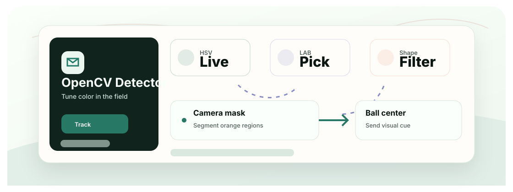

<div align="center">
  <h1>OrangeBall Detection with OpenCV</h1>
  <p>一个可实时调参的 OpenCV 橙色高尔夫球检测器，面向机器人摄像头画面。</p>

  <p>
    <a href="README.md">English</a>
    &middot;
    <a href="#快速开始">快速开始</a>
    &middot;
    <a href="#核心能力">核心能力</a>
    &middot;
    <a href="#技术栈">技术栈</a>
  </p>

  <p>
    
    
    
  </p>
</div>

<p align="center">
  
</p>

## 项目概览

这是橙色球体检测的传统计算机视觉路线，重点是快速实时调参，而不是训练模型。

检测器暴露颜色和形状参数，便于在机器人现场测试中快速适应光照变化。

## 核心能力

- 带摄像头编号回退逻辑的实时检测器。
- 通过 HSV/LAB 和形态学参数适应光照变化。
- 使用圆度、填充率和边框形状过滤非球体区域。
- 保留草地、颜色、灰度和 GUI 等实验脚本。
- 可作为轻量视觉 cue，也可与更重的学习式检测互补。

## 工作方式

1. 用 OpenCV 打开摄像头画面。
2. 构建可能橙色区域的颜色掩码。
3. 清理掩码并提取轮廓。
4. 根据几何特征筛选候选区域。
5. 输出/显示球心位置，供下游机器人逻辑使用。

## 快速开始

可以用下面的命令在本地运行项目。

```bash
git clone https://github.com/Ha22yX/OrangeBall-Detection-with-OpenCV.git
cd OrangeBall-Detection-with-OpenCV
python -m venv .venv
.venv\Scripts\activate
pip install -r requirements.txt
python src/orange_detector.py
```

如果自动扫描选错摄像头，可以设置 `CAM_INDEX=1` 或其他编号。

## 配置项

| 项目 | 作用 |
| --- | --- |
| `CAM_INDEX` | 强制指定 `/dev/videoX` 或摄像头编号。 |
| 阈值 | 根据测试环境调整颜色和形态学参数。 |
| 实验脚本 | 用 `experiments/` 下的脚本比较不同检测方案。 |

## 技术栈

| 层级 | 技术 | 作用 |
| --- | --- | --- |
| 视觉 | OpenCV | 颜色分割和轮廓过滤。 |
| 数学 | NumPy | 掩码和坐标运算。 |
| 运行时 | Camera feed | 实时调参和标注输出。 |
| 机器人 | Image-space center | 下游控制逻辑的视觉 cue。 |

## 项目结构

```text
src/orange_detector.py        推荐的实时检测器
experiments/                   历史检测实验
requirements.txt               Python 依赖
.github/assets/                README 概览图
```

## 项目状态

传统视觉实验。学习式检测请看 YOLO Orange Ball Detection 仓库。

## 相关项目

- [Yolo-Orange-Ball-detection](https://github.com/Ha22yX/Yolo-Orange-Ball-detection) - 同一目标的 YOLO 训练和推理路线。

## 许可证

当前仓库尚未声明项目级开源许可证；公开复用或分发前建议先补充 License。
